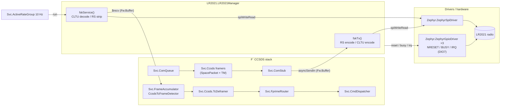
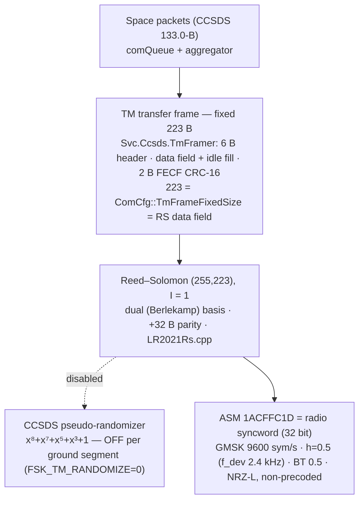
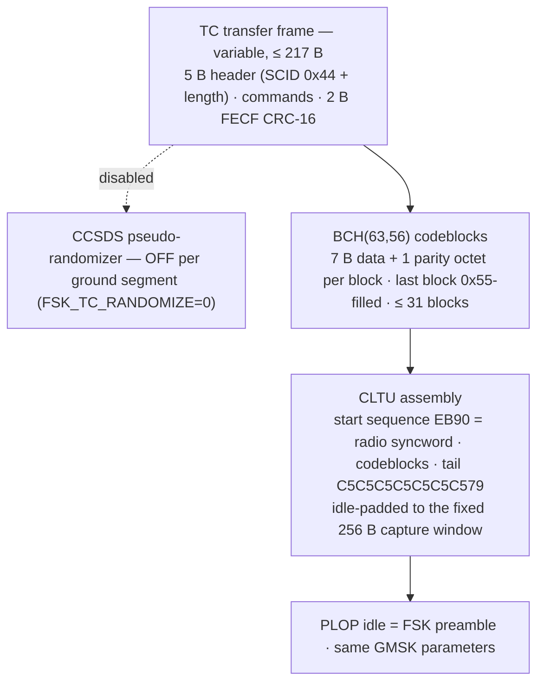
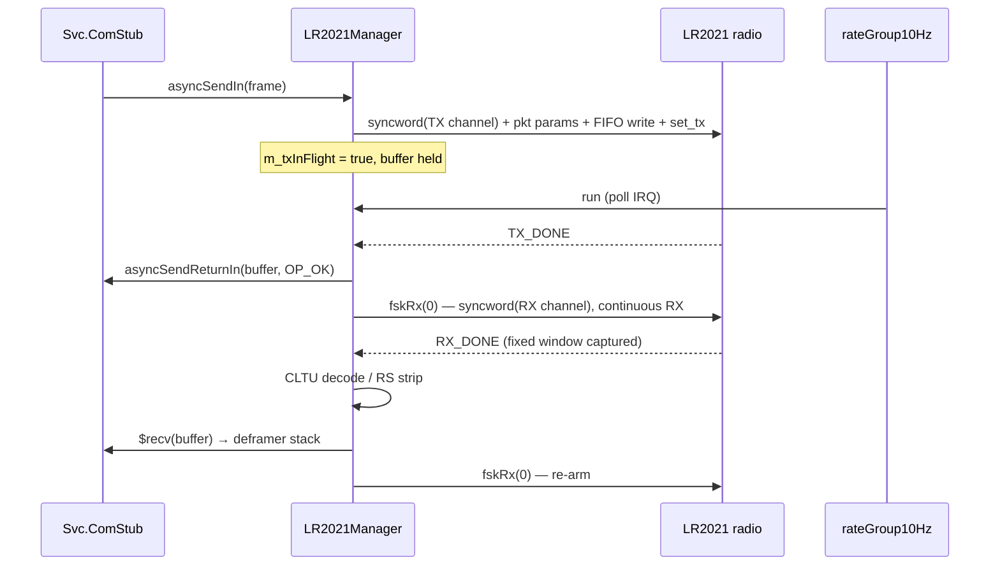

# LR2021::LR2021Manager

The `LR2021::LR2021Manager` is an F´ manager component for the Semtech LR2021 (LR20xx)
transceiver. It owns the vendored `lr20xx_driver` C driver, reaches the hardware through a
Zephyr SPI bus plus reset / busy / IRQ GPIO lines, and implements the
`Drv.ByteStreamDriverModel` interface so it can serve as the com driver of a CCSDS
communication stack (`Svc.ComStub` / `ComCcsds` subtopology).

Two modulations are supported and can be switched at runtime with the `SET_MODE` command:

- **FLRC** — Semtech Fast Long Range Communication (2.4 GHz band), variable-length packets.
- **FSK (GMSK)** — CCSDS-compatible UHF link: GMSK modulation per CCSDS 401.0-B, TM channel
  per CCSDS 131.0-B / 132.0-B with Reed–Solomon coding, TC channel per CCSDS 231.0-B / 232.0-B
  with BCH-coded CLTUs. This is the mode documented in detail below.

## Component Context

Buffer ownership: `asyncSendIn` buffers are held in `m_workingBuffer` until `TX_DONE`
(or an abort) and returned through `asyncSendReturnIn`. Receive buffers are obtained
from `allocate` (BufferManager), emitted on `$recv`, and returned via
`recvReturnIn` → `deallocate`.

## CCSDS Roles

The FSK mode is a two-channel CCSDS link. Which channel is transmitted and which is
received is selected by `setCcsdsRole()` (call from the topology before `setMode()`):

| Role | TX channel | RX channel |
|---|---|---|
| `SPACECRAFT` (default) | TM (telemetry downlink) | TC (telecommand uplink) |
| `GROUND` (bench gateway) | TC | TM |

## Channel Coding Chains (FSK / GMSK mode)

### TM downlink — CCSDS 131.0-B / 132.0-B

On the air (263 B ≈ 219 ms at 9600 sym/s):

| preamble | ASM | TM frame | RS parity |
|---|---|---|---|
| 32 bit `0101…` | 4 B `1A CF FC 1D` | 223 B | 32 B |

Receive side (`GROUND` role / real ground station): GMSK demod → ASM correlation →
RS decode (a real GS corrects ≤ 16 byte errors; the onboard `GROUND` role only strips
the parity — the frame CRC rejects corrupted frames downstream).

### TC uplink — CCSDS 231.0-B / 232.0-B

On the air (fixed 256 B capture window ≈ 213 ms):

| PLOP idle / preamble | EB90 | codeblocks | tail | idle pad |
|---|---|---|---|---|
| ≥ 16 bit `0101…` | 2 B | n × 8 B | 8 B | to 256 B |

Receive side (`SPACECRAFT` role): syncword `EB90` → fixed 256 B capture → leading-byte
alignment scan (≤ `CLTU_MAX_LEAD_SKIP`) → per-block BCH parity check (TED: stop at the
tail sequence or the first failing block) → recovered bytes (frame + fill) to
`FrameAccumulator`, whose `CcsdsTcFrameDetector` extracts the frame (SCID + CRC) and
discards the fill.

A real ground station transmits **variable-length** CLTUs; this is compatible with the
fixed capture window because decoding stops at the tail sequence and the remainder of
the window (idle or noise) is discarded.

### TX / RX operation sequence

The chip has a single FSK syncword register, so the syncword is rewritten before every
TX and RX operation (`fskApplySyncword`).

## Hardware Constraints and Quirks (verified on hardware)

These were found during bench bring-up (two LR2021 nodes, one per role) and shape the
design; both were verified byte-exactly against BCH parity arithmetic.

1. **256-byte radio FIFO, single-shot transfers.** The TX/RX FIFO is read/written in one
   SPI transfer with no threshold streaming, so every on-air packet must be ≤ 256 B.
   A 264 B packet wraps the FIFO ring and the trailing bytes overwrite codeblock 0.
   Hence `FSK_CLTU_MAX_BLOCKS = 31` (packet exactly 256 B, verified good) and the
   TM packet at 255 B.

2. **TX first-byte corruption with a 16-bit syncword.** The LR2021 **transmit** modem
   replaces the first payload byte after a 16-bit syncword with the preamble value
   (`0x55`). The receive path is clean (proven by transmitting a 24-bit syncword and a
   distinctive first byte). Workaround: the TC **TX** syncword is `55 EB 90` (24 bit) —
   one PLOP idle octet absorbed into the syncword, which matches what a real ground
   station puts on the air anyway — while the TC **RX** syncword remains the bare
   standard `EB90` (16 bit), so a real ground station is received as-is. The RX decoder
   additionally scans up to 4 leading bytes for codeblock alignment (defensive).

## Ground Segment Interface Summary

Per the ground segment: TC CCSDS 231.0-B-4; TM CCSDS 131.0-B-5 with **RS and
convolutional decoding only** (their LDPC/BCH FEC applies to DVB-S2 services, not this
link); randomization **disabled** both directions; channel rate up to 10 kbps.
Convolutional and concatenated RS+CC were ruled out by the 10 kbps symbol-rate cap.

| Parameter | Value | Notes |
|---|---|---|
| Modulation | GMSK, 9600 sym/s, h = 0.5, BT 0.5 | non-precoded, NRZ-L; `f_dev = bitrate/4 = 2.4 kHz` |
| RX bandwidth | 20 kHz | Carson 14.4 kHz + ±2.8 kHz offset margin; assumes GS Doppler compensation (else 41 kHz) |
| Doppler @ 437 MHz, 550 km LEO | ±10.2 kHz, ≤ 150 Hz/s | quasi-static within one packet; no FEI/AFC in the driver |
| TM | ASM `1ACFFC1D`, fixed 223 B frame, RS(255,223) I=1, randomization off | ~4.5 frames/s ≈ 7.7 kbit/s net |
| TC | CLTU/BCH, ≤ 31 codeblocks, max frame 217 B, randomization off | ≥ ~350 ms between CLTU start sequences (capture window + re-arm) |
| RSSI telemetry | use `rssi_sync_in_dbm` | `rssi_avg` averages over the fixed window and is meaningless for short CLTUs |

## Port Descriptions

| Kind | Name | Port Type | Description |
|---|---|---|---|
| Output | ready | Drv.ByteStreamReady | Signals the driver is ready (after a successful mode init) |
| Output | $recv | Drv.ByteStreamData | Received (decoded) data to the com stack |
| Input (guarded) | recvReturnIn | Fw.BufferSend | Returns ownership of `$recv` buffers |
| Input (async) | asyncSendIn | Fw.BufferSend | Frame to transmit (from `Svc.ComStub`) |
| Output | asyncSendReturnIn | Drv.ByteStreamData | Returns the send buffer with status |
| Output | allocate / deallocate | Fw.BufferGet / Fw.BufferSend | RX buffer management |
| Input (async, drop) | run | Svc.Sched | Rate-group tick: IRQ polling / packet servicing |
| Output | spiWriteRead | Drv.SpiWriteRead | SPI bus (full-duplex) |
| Output | resetGpioWrite | Drv.GpioWrite | NRESET line (active low) |
| Output | busyGpioRead / irqGpioRead | Drv.GpioRead | BUSY line; radio IRQ (DIO7) |

## Commands

| Name | Description |
|---|---|
| RESET | Re-initialise the chip (`radioInit()`) and restore the active mode/frequency/power |
| SET_MODE(mode, freq_hz, power_dbm) | Switch modulation (FLRC / FSK) at runtime; enters continuous RX |

## Events / Telemetry

| Name | Kind | Description |
|---|---|---|
| LR2021 | event, diagnostic | Debug / bring-up log |
| HalError | event, warning high | HAL / SPI operation failed |
| ModeSet | event, activity high | Radio mode changed |
| FskRxPacket / FskTxDone / FskError | events | FSK link activity and radio errors |
| FlrcRxPacket / FlrcTxDone / FlrcError | events | FLRC equivalents |
| FskTxCount / FskRxCount / FskRssi | telemetry | FSK link counters and last RSSI |
| FlrcTxCount / FlrcRxCount / FlrcRssi | telemetry | FLRC equivalents |

## Configuration Reference (`LR2021Cfg.hpp`)

| Define / constant | Default | Meaning |
|---|---|---|
| `FSK_BITRATE_BPS` | 9600 | Symbol rate (GS cap 10 kbps) |
| `FSK_FDEV_HZ` | bitrate/4 | GMSK condition h = 0.5 — do not change independently |
| `FSK_RX_BW` | 20 kHz | RX filter; widen to 41 kHz if the GS does not compensate Doppler |
| `FSK_PULSE_SHAPE` | Gaussian BT 0.5 | CCSDS 211.1 GMSK profile |
| `FSK_PREAMBLE_BITS` / `FSK_PREAMBLE_DETECTOR` | 32 / 16 bits | Preamble gating (false-sync + AGC settling) |
| `FSK_FIXED_PAYLOAD_LEN` | 223 | TM frame = RS data field; must equal `ComCfg::TmFrameFixedSize` |
| `FSK_TM_RS` | 1 | RS(255,223) on the TM downlink |
| `FSK_TM_RANDOMIZE` / `FSK_TC_RANDOMIZE` | 0 / 0 | CCSDS pseudo-randomizer (must match the GS) |
| `FSK_TM_SYNCWORD` | ASM, 32 bit | TM channel syncword |
| `FSK_TC_RX_SYNCWORD` / `FSK_TC_TX_SYNCWORD` | `EB90` 16 bit / `55EB90` 24 bit | Asymmetric per the TX first-byte quirk |
| `FSK_CLTU_MAX_BLOCKS` | 31 | TC capacity 217 B; packet exactly 256 B (FIFO bound) |
| `CLTU_LEAD_PAD` / `CLTU_MAX_LEAD_SKIP` | 0 / 4 | Optional TX pad; RX alignment scan |
| `FLRC_*` | — | FLRC mode equivalents (see `LR2021Flrc.cpp`) |

## Requirements

| Name | Description | Validation |
|---|---|---|
| LR2021-001 | The component shall implement the byte-stream driver model over the LR2021 radio (send, receive, ready, buffer return). | Bench test |
| LR2021-002 | In FSK mode the TM downlink shall be a CCSDS channel: ASM + fixed-length TM frame + RS(255,223) codeblock, GMSK per CCSDS 401.0-B. | Bench test, RS properties verified against CCSDS definitions |
| LR2021-003 | In FSK mode the TC uplink shall accept CCSDS 231.0-B CLTUs (BCH(63,56) codeblocks, tail-terminated, variable length) within a 256 B capture window. | Bench test incl. variable-length CLTU |
| LR2021-004 | The component shall switch modulation at runtime via SET_MODE and restore the active mode after RESET. | Bench test |
| LR2021-005 | Every on-air packet shall fit the 256 B radio FIFO in a single transfer. | Static assert + bench test |
